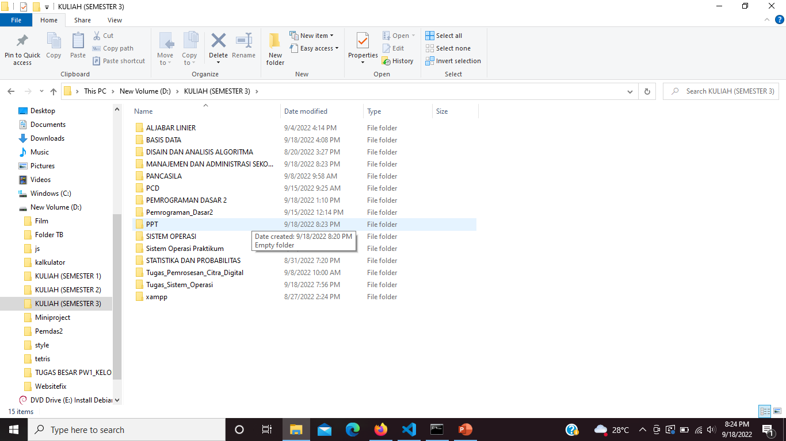
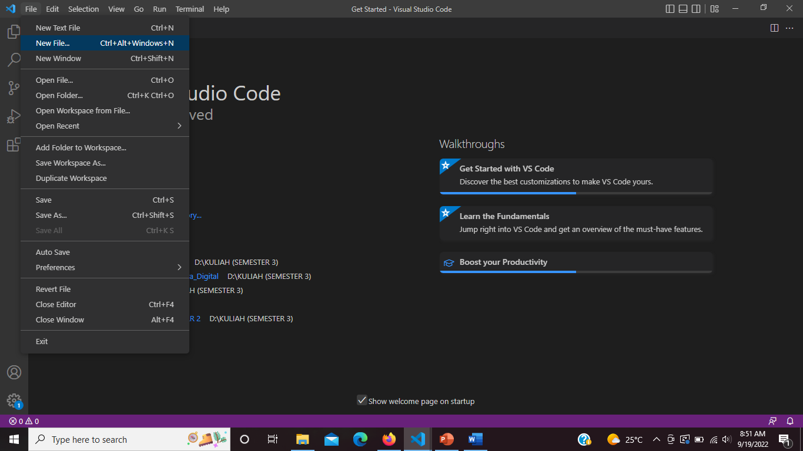
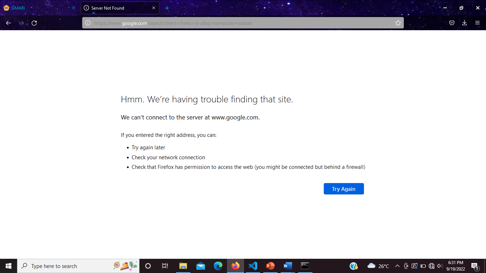

**Nama : Meyda Wikaromah**

**NIM : 2110131220015**

**Mata Kuliah : Sistem Operasi**

----

## **KOMPONEN SISTEM OPERASI, LAYANAN SISTEM OPERASI, DAN SYSTEM CALL**

### **A. Komponen Sistem Operasi**

Sebuah sistem operasi dapat dibagi menjadi beberapa komponen. Secara umum, para pakar sepakat bahwa terdapat sekurangnya empat komponen manajeman utama yaitu: 

- Manajemen Proses, 

- Manajemen Memori, dan 

- Manajamen Sistem Berkas. 

- Manajemen Masukan/Keluaran

Selain keempat komponen di atas, Avi Silberschatz, dan kawan-kawan menambahkan beberapa komponen seperti: 

- Manajemen Penyimpanan Sekunder.

- Manajemen Sistem Proteksi. 

- Manajemen Jaringan. 

- Command-Interpreter System. 

**1. Manajemen Sistem Berkas**

Berkas adalah kumpulan informasi yang berhubungan, sesuai dengan tujuan pembuat berkas tersebut. 
Umumnya berkas merepresentasikan program dan data. Berkas dapatmempunyai struktur yang bersifat hirarkis (direktori, volume, dll.).
Sistem operasi mengimplementasikan konsep abstrak dari berkas dengan mengatur media penyimpanan massa, misalnya tapes dan disk. 

Contoh dari komponen sistem operasi manajemen sistem berkas adalah bagaimana kita memindahkan file dari satu folder ke dalam folder yang lain. Berikut langkah-langkahnya : 

Pertama buka file explorer.

Kemudian, kita buka New Volume(:D). Dalam New Volume(:D) tersebut berisi beberapa folder. Misal kita pilih folder dengan nama KULIAH(SEMESTER 3).

Dalam folder KULIAH(SEMESTER 3) terdapat beberapa folder lagi. Kita buka folder dengan nama PPT.

Folder tersebut ternyata masih kosong. Disini kita ingin memindahkan sebuah file dari folder lain ke dalam folder PPT.

Kita coba memindahkan file yang ada dalam folder Manajemen dan Administrasi Sekolah.

Pilih file yang ada pada folder Manajemen dan Administrasi Sekolah kemudian klik kanan. Maka akan muncul tampilan seperti pada gambar di atas. Pilih opsi Cut.

Lalu buka folder PPT kemudian klik kanan dan pilih opsi Paste.

File yang tadinya berada dalam folder Manajemen dan Administrasi Sekolah telah berhasil kita pindahkan ke dalam folder ppt.

**2. Manajemen Penyimpanan Sekunder**

Data yang disimpan dalam memori utama bersifat sementara dan jumlahnya sangat kecil. Oleh karena itu, untuk menyimpan keseluruhan data dan program komputer dibutuhkan penyimpanan sekunder yang bersifat permanen dan mampu menampung banyak data, sebagai back-up dari memori utama.

Contoh dari komponen sistem operasi manajemen penyimpanan sekunder adalah bagaimana kita menggunakan flashdisk pada laptop. Berikut langkah-langkahnya : 

Pertama pasang flashdisk ke tempatnya (ada di samping kanan atau kiri laptop). Setelah dipasang biasanya akan muncul tampilan pada gambar di atas. Pemindaian apakah terdapat virus dalam flashdisk tersebut atau tidak.

Selanjutnya buka file explorer. Dibagian bawah terdapat penyimpanan dengan nama USB Drive(F:). Klik maka akan muncul apa saja yang ada di dalam penyimpanan flashdisk yang kita punya. Flashdisk yang saya gunakan disini isinya masih kosong. Kita dapat menambahkan, membuat, memindah, dan menghapus folder atau file ke dalam flashdisk ini.

Selanjutnya, jika kita telah selesai memakai flashdisk jangan langsung melepasnya. Klik kanan pada penyimpanan dengan nama USB Drive(F:) kemudian pilih opsi Eject.

Akan muncul tampilan pada gambar di atas yang artinya flashdisk sudah aman untuk kita lepas.

**3. Manajemen Jaringan**

Sistem terdistribusi adalah sekumpulan prosesor yang tidak berbagi memori, atau clock. Setiap prosesor mempunyai memori dan clock tersendiri. Prosesor-prosesor tersebut terhubung melalui jaringan komunikasi Sistem terdistribusi menyediakan akses pengguna ke bermacam sumber-daya sistem. Akses tersebut menyebabkan peningkatan kecepatan komputasi dan meningkatkan kemampuan penyediaan data. 

Contoh dari komponen sistem operasi manajemen jaringan adalah bagaimana kita menyambungkan jaringan internet ke perangkat laptop kita. Berikut langkah-langkahnya :

Pertama klik ikon jaringan yang ada di pojok kanan bawah. Setelah di klik akan muncul beberapa jaringan internet yang bisa kita sambungkan.

Misal kita pilih jaringan yang ada di paling atas. Klik Connect.

Setelah klik Connect laptop kita akan melakukan proses Connecting pada jaringan tersebut.

Jika proses Connecting telah selesai maka akan muncul tampilan seperti pada gambar di atas, yang artinya perangkat laptop kita telah terhubung dengan jaringan internet.

### **B. Layanan Sistem Operasi**

Layanan sistem operasi dirancang untuk membuat pemrograman menjadi lebih mudah. 

**1. Pembuatan Program**

Sistem operasi menyediakan berbagai fasilitas yang membantu programmer dalam membuat program seperti editor. Walaupun bukan bagian dari sistem operasi, tapi layanan ini diakses melalui sistem operasi. Contoh seperti Visual Studio Code yang bisa kita gunakan untuk keperluan coding. Kita dapat membuat file dengan format .html, .java, .md dan lainnya. Berikut contoh penggunaannya :

Buka Visual Studio Code.

Setelah dibuka akan muncul tampilan seperti pada gambar di atas.

Klik file yang ada di pojok kiri atas. Kemudian pilih opsi new file.

Ketik nama file baru beserta format yang diinginkan. Misalnya tugas2.md

Pilih folder tempat kita akan menyimpan file baru tersebut. Jika sudah klik create file.

Maka file sudah bisa kita isi sesuai dengan keinginan. Disini kita dapat menulis, menghapus, menambahkan gambar.

**2. Sistem Manipulasi Berkas.**

Kemampuan program untuk operasi pada berkas (membaca, menulis, membuat, dan menghapus berkas yang berupa file atau direktori). Kita akan coba untuk menghapus sebuah berkas. Berikut langkah-langkahnya :

Pertama kita buka file explorer.

Kemudian pilih folder atau file yang ingin di hapus. Disini saya ingin menghapus folder dengan nama file1.

Klik kanan lalu pilih opsi Delete.

Maka folder yang sudah dipilih akan terhapus.

**3. Deteksi Error**

Sistem operasi harus selalu waspada terhadap kemungkinan error. Error dapat terjadi di CPU dan memori perangkat keras, Masukan/Keluaran, dan di dalam program yang dijalankan pengguna. Untuk setiap jenis error sistem operasi harus bisa mengambil langkah yang tepat untuk mempertahankan jalannya proses komputasi. Misalnya dengan menghentikan jalannya program, mencoba kembali melakukan operasi yang dijalankan, atau melaporkan kesalahan yang terjadi agar pengguna dapat mengambil langkah selanjutnya. Misal kita mencoba melakukan pencarian di internet tetapi perangkat komputer kita tidak terhubung ke jaringan internet maka sistem akan mendeteksi adanya masalah dan memberitahu apa yang perlu kita cek. 

Pertama buka browser.

Kemudian coba ketik pada kolom pencarian.

Setelah kita enter maka akan muncul tampilan pada gambar di atas. Dimana tertera bahwa ada sebuah masalah ketika melakukan pencarian. Ini terjadi karena perangkat komputer kita tidak terhubung pada jaringan internet.

### **C. System Call**

Biasanya tersedia sebagai instruksi bahasa assembly. Beberapa sistem mengizinkan system calls dibuat langsung dari program bahasa tingkat tinggi. Beberapa bahasa pemrograman (contoh: C, C++) telah didefenisikan untuk menggantikan bahasa assembly untuk sistem pemrograman. Tiga metode umum yang digunakan dalam memberikan parameter kepada sistem operasi: 

1. Melalui register. 

2. Menyimpan parameter dalam block atau tabel pada memori dan alamat block tersebut diberikan  sebagai parameter dalam register. 

3. Menyimpan parameter (push) ke dalam stack oleh program, dan melakukan pop off pada stack  oleh sistem operasi. 

**1. System Call Manajemen Berkas**

System calls yang berhubungan dengan berkas sangat diperlukan. Seperti ketika kita ingin membuat atau menghapus suatu berkas. Atau ketika ingin membuka atau menutup suatu berkas yang telah ada, membaca berkas tersebut, dan menulis berkas itu. System calls juga diperlukan ketika kita ingin mengetahui atribut dari suatu berkas atau ketika kita juga ingin merubah atribut tersebut. Yang termasuk atribut berkas adalah nama berkas, jenis berkas, dan lain-lain. Disini kita akan mencoba untuk membuat sebuah berkas berupa folder.

Pertama buka file explorer.

Kemudian pilih lokasi dimana kita ingin membuat folder baru. Klik New Folder pada bagian paling atas.

Setelah itu kita dapat memberi nama folder sesuai keinginan.

Maka akan muncul tampilan pada gambar diatas yang artinya kita telah berhasil membuat sebuah folder baru.

**2. System Call Informasi/Pemeliharaan.**

Beberapa system calls disediakan untuk membantu pertukaran informasi antara pengguna dan sistem operasi. Contohnya system calls untuk meminta dan mengatur waktu dan tanggal. Atau meminta informasi tentang sistem itu sendiri, seperti jumlah pengguna, jumlah memori dan disk yang masih bisa digunakan, dan lain-lain. Ada juga system calls untuk meminta informasi tentang proses yang disimpan oleh sistem dan system calls untuk merubah (reset) informasi tersebut. 
Disini kita akan mencoba untuk mengecek jumlah penyimpanan yang masih bisa digunakan.

Pertama buka file explorer.

Kemudian klik pada bagian This PC. Maka akan muncul tampilan pada gambar di atas. Disitu tertera informasi tentang penyimpanan yang kita miliki. Pada Windows(C:) tersedia 31.7 GB dari 117 GB yang masih bisa kita gunakan. Pada New Volume(D:) tersedia 109 GB dari 120 GB yang masih bisa kita gunakan.

**3. System Call Komunikasi**

Message-passing. Pertukaran informasi dilakukan melalui fasilitas komunikasi antar proses yang 
disediakan oleh sistem operasi. Misal kita bisa mendapatkan sebuah informasi yang dikirimkan oleh sistem pada perangkat komputer kita.

Klik ikon pesan yang ada di pojok kanan bawah.

Maka akan muncul tampilan pada gambar di atas. Dimana sistem mengirimkan sebuah pesan berisi informasi.

